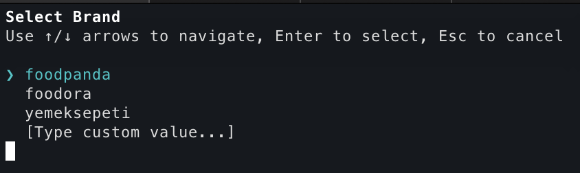
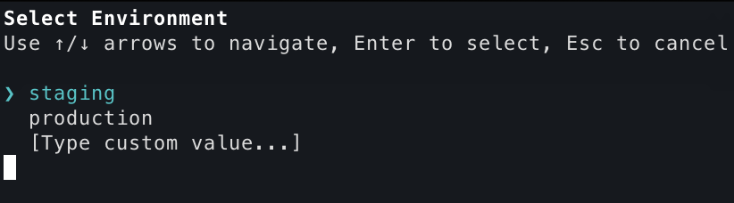

# xcode-helper

Helper tools for Xcode project management.

## Installation

```bash
brew tap lromyl/tap
brew install xcode-helper
```

## Getting Started

This tool is designed to be run **one level above** `pd-mob-b2c-ios`:

```
~/Work/                          # ← Run xcode-helper from here
├── pd-mob-b2c-ios/
├── pd-mob-subscription-ios/
└── ...
```

## Commands

| Command | Description |
|---------|-------------|
| `dh-branding` | Interactive project branding and environment setup |
| `link` | Manage local framework linking for debugging |

---

## dh-branding

Configure project branding and environment interactively with arrow-key navigation.

### Usage

```bash
xcode-helper dh-branding
```

### What it does

1. Display a list of brands (foodpanda, foodora, yemeksepeti) for selection
2. Display a list of environments (staging, production) for selection
3. Open iTerm/Terminal and run the bootstrap script with selected options

### Examples

```bash
# Run from directory containing bootstrap.sh
xcode-helper dh-branding
```
<table>
  <tr>
    <td width="50%">
      
      <p align="center"><strong>Input 1</strong> - For which brand</p>
    </td>
    <td width="50%">
      
      <p align="center"><strong>Input 2</strong> - For which environment</p>
    </td>
  </tr>
</table>

> Custom values can be entered by selecting "[Type custom value...]" option.

---

## link

Manage local framework linking to debug framework source code directly in your main app.

### Subcommands

| Subcommand | Description |
|------------|-------------|
| `enable <mapping>` | Enable local framework linking |
| `disable <mapping>` | Restore original configuration |
| `status` | Show current linking state |
| `fix [mapping]` | Fix corrupted project |

### Usage

```bash
# Enable linking
xcode-helper link enable subscription

# Disable linking
xcode-helper link disable subscription

# Check status
xcode-helper link status

# Fix corrupted project
xcode-helper link fix
xcode-helper link fix subscription
```

### Options

| Option | Description |
|--------|-------------|
| `--path <dir>` | Override working directory (default: current directory) |
| `--dry-run` | Preview changes without applying |
| `--verbose` | Show detailed output |

### Supported Mappings

| Mapping | Framework |
|---------|-----------|
| `subscription` | pd-mob-subscription-ios |

### What `enable` does

1. Remap framework paths in the source project to use shared dependencies
2. Replace the xcframework with a nested xcodeproj reference in the target project
3. Allow you to set breakpoints and debug framework source code

### What `disable` does

1. Restore original framework paths in the source project
2. Replace the nested xcodeproj with the original xcframework reference

### Fix Command

Attempts to fix a corrupted project by regenerating it using Tuist or XcodeGen.

**Detection:**
- **Tuist**: Looks for `Project.swift`, `Workspace.swift`, or `Tuist/` directory
- **XcodeGen**: Looks for `project.yml`, `project.yaml`, or `project.json`

### Example Workflow

```bash
# From ~/Repos (containing pd-mob-b2c-ios and pd-mob-subscription-ios)
cd ~/Repos

# Enable debugging
xcode-helper link enable subscription

# Open Xcode and debug
open pd-mob-b2c-ios/Volo.xcworkspace

# When done, disable linking
xcode-helper link disable subscription
```

### Limitations

- For Tuist/XcodeGen managed projects, use `xcode-helper link fix` to regenerate after issues

---

## Requirements

- macOS 13+
- Xcode
